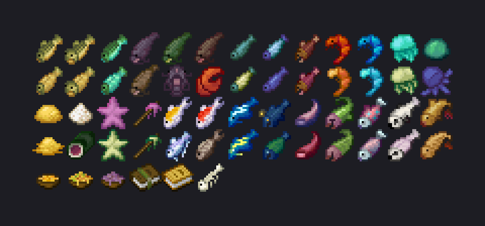

# Fishing101
Adds tons of new aquatic life forms to the game (items, not entities).
Server-side mod + resource pack `/polymer generate-packs`.

<figure>
    
    <figcaption style="text-align: center;">All mod items</figcaption>
</figure>

    

        Main features
    

- 58 items
- Time-of-day-specific fish (and biome-specific, weather-specific, height-specific, etc.)
- Different fish types have different rarities and food stats
- Every marine creature can be cooked (except some special fish)
- New food & ingredients
- 2 guide books found in villages & from _Hero of the village_ gifts

To learn about the mod in-game, read the books: _Fisherman's Journal_ and _Johnny's Cook Book_.

##### 

    

        Spoiler images
    

<figure>
    
    <figcaption style="text-align: center;">"Ascension effect" after eating a Divine Catfish</figcaption>
</figure>

<figure>
    
    <figcaption style="text-align: center;">Tentacle item</figcaption>
</figure>

<figure>

    <figcaption style="text-align: center;">Charged Thunderfin</figcaption>
</figure>

##### 

    

        Latest changes
    

- Polish translation
- item group (+ creative inventory tab) on client-side of the mod
- minor balance changes

Plans for the future: Crab Claw rework, more translations and more.

##### 
Huge thanks to Patbox and his [Polymer library](https://github.com/Patbox/polymer).

More to come. Feel free to leave feedback & suggestions.
