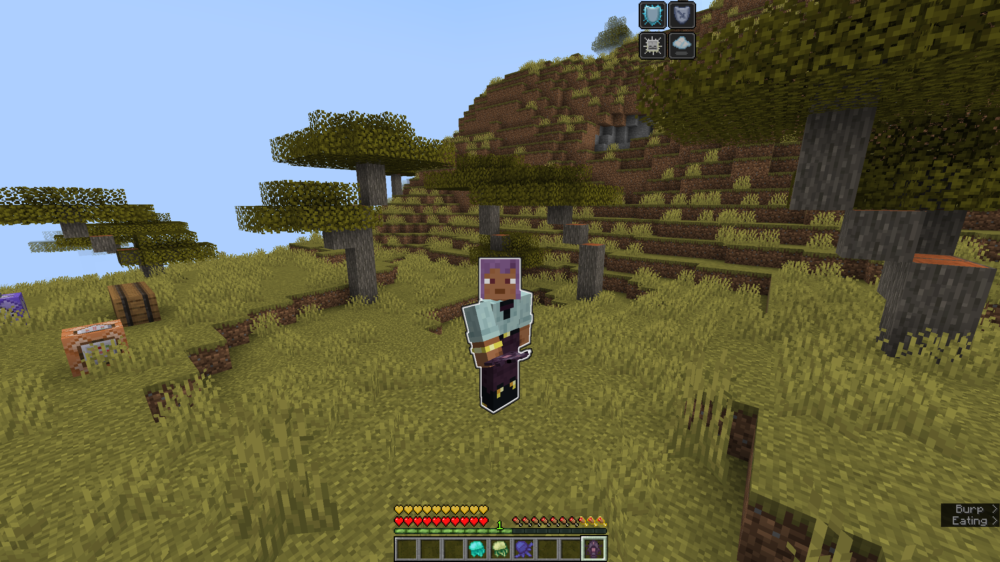
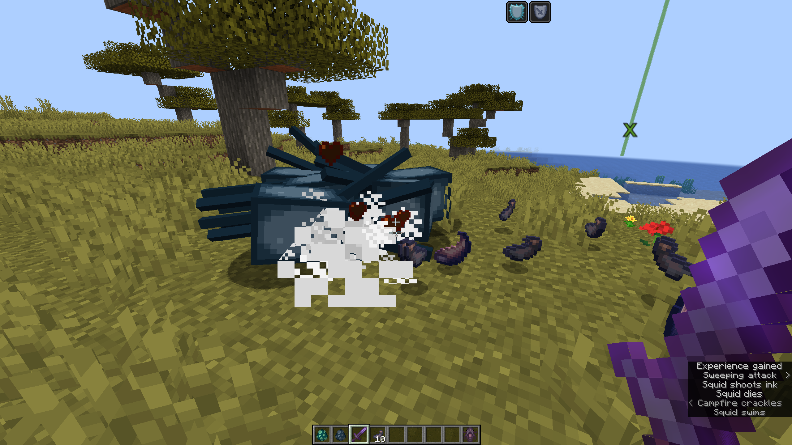
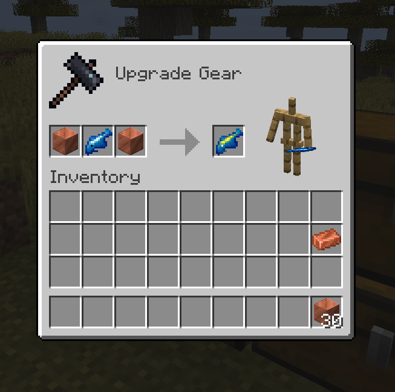

# Fishing101
Adds 23 new aquatic life forms to the game (items, not entities).
Mod is fully serverside, but resource pack is strongly recommended `/polymer generate-packs`.

### Features:
- 48 items.
- Time-of-day-specific fishes (also: biome-specific, weather-specific, height-specific).
- Different fish types have different rarities and food stats. 
- Some fish can __only__ be cooked or __only__ be smoked (yay - new usage for smokers!).
- New food & ingredients.
- 2 books found in villages & from _Hero of the village_ gifts.

To learn about the mod read the books: _Fisherman's Journal_ and _Johnny's Cook Book_.

    
Click to reveal spoiler images

""Ascending"" after eating a Divine Catfish
    

Tentacles
    

Charging Thunderfin
    

Huge thanks to Patbox and his [Polymer library](https://github.com/Patbox/polymer).

More content to come. Feel free to give feedback.

