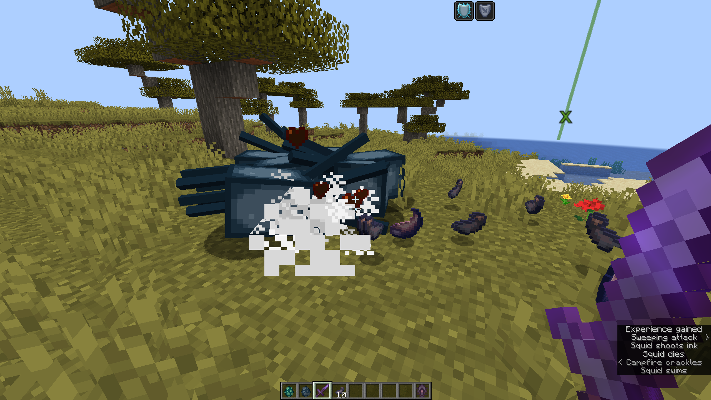
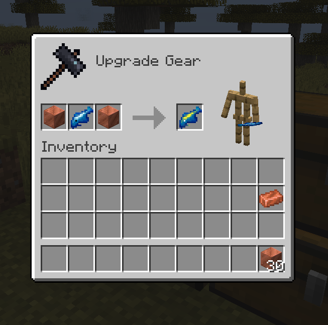

# Fishing101
Adds tons of new aquatic life forms to the game (items, not entities).
Server-side mod + resource pack `/polymer generate-packs`.

    

        Main features
    

- 62 items (27 new fish types)
- Time-of-day-specific fish (and biome-specific, weather-specific, etc.)
- Different fish types have different rarities and food stats (and effects)
- Every marine creature can be cooked ([with a few exceptions](https://github.com/Macck209/Fishing101/wiki/Crafting-recipes))
- New food & ingredients
- 2 guide books obtained from _Hero of the village_ gifts
- 2 new armor trims

To learn about the mod in-game, read the books: _Fisherman's Journal_ and _Johnny's Cook Book_ or see [the wiki](https://github.com/Macck209/Fishing101/wiki).

##### 

    

        Spoiler images
    

<figure>
    
    <figcaption style="text-align: center;">"Ascension effect" after eating a Divine Catfish</figcaption>
</figure>

<figure>
    
    <figcaption style="text-align: center;">Tentacle item</figcaption>
</figure>

<figure>

    <figcaption style="text-align: center;">Charged Thunderfin</figcaption>
</figure>

##### 

    

        Latest changes
    

- Improved fish loot tables (luminous fish were too rare before, etc.)
- 1.21.9
- Modded fish now work with dolphins, cats, ocelots and wolves (taming, breeding, healing, etc.)

Plans for the future: Who knows? Tell me what would you like to see [here](https://github.com/Macck209/Fishing101/issues)!

##### 
Huge thanks to Patbox and his [Polymer library](https://github.com/Patbox/polymer).

More to come. Feel free to leave feedback & suggestions.
